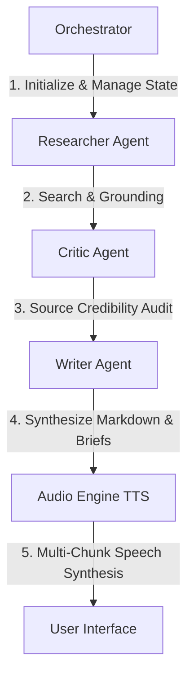

# Argus Research Assistant 2.0

## 🔍 Overview

Argus Research Assistant 2.0
Argus Research Assistant 2.0 is an advanced, production-grade agentic AI research platform designed to automate the entire academic and literature review pipeline. Powered by a state-driven multi-agent network, it orchestrates deep web sourcing, rigorous credibility auditing, high-density synthesis, and multi-modal audio outputs.

## 🚀 Key Features
Multi-Agent State Orchestrator: Manages complex agent transitions and streams real-time telemetry logs via Server-Sent Events (SSE).

Dual-Layer Sourcing (Researcher Agent): Leverages Gemini 3.5 with Google Search Grounding for authoritative data, backed by a robust fallback layer utilizing Groq (Llama-3.3-70b) and OpenRouter.

Automated Peer-Review (Critic Agent): Audits source credibility, filtering out low-quality links to retain high-fidelity domains like arXiv and Nature.

High-Density Synthesis (Writer Agent): Generates citation-rich Markdown Research Portfolios alongside concise Executive Briefings.

Multi-Modal Audio Engine: Converts sanitized briefings into high-fidelity WAV audio using gemini-3.1-flash-tts-preview (Kore premium voice).

PDF Analyst: Ingests, parses, and extracts deep structural insights from user-uploaded research papers.

Production-Grade Security: Equipped with simulated SMS MFA, JWT session management, Google SSO bypass validation, and salted PBKDF2 local credential hashing.

## 🛠️ System Architecture & Agent Pipeline

Argus implements a sequential multi-agent state network:



1. **State Orchestrator**: Manages state transitions, tracks agent statuses, and publishes real-time telemetry logs to the frontend via Server-Sent Events (SSE).
2. **Researcher Agent**: Initiates search queries. It uses Gemini 3.5 with **Google Search Grounding** to fetch authoritative scientific and academic papers. It features a multi-tiered fallback architecture (Gemini Text Synthesis, Groq Llama 3.3, OpenRouter, and local fallback links) if quotas or rate limits are reached.
3. **Critic Agent**: Audits every discovered source for authority, scientific integrity, and domain trust, systematically filtering out low-tier or irrelevant sites while keeping premium documentation (e.g., `arxiv.org`, `nature.com`, `github.com`).
4. **Writer Agent**: Consolidates the audited, high-density facts and writes a professional, citation-linked 4-section Markdown Research Portfolio, along with a structured Briefing Summary.
5. **Audio Engine**: Sanitizes the briefing text, formats it for narration, and utilizes `gemini-3.1-flash-tts-preview` (with the premium voice `Kore`) to synthesize high-fidelity WAV audio chunks, complete with dynamic RIFF wave headers for seamless HTML5 browser playback.

---


## 🚀 Getting Started

### Prerequisites

- **Node.js** (v18 or higher recommended)
- **NPM** or **Yarn**
- Active API keys for:
  - Google Gemini API (Required for base search and TTS)
  - Groq API / OpenRouter API (Optional; for fallback Critic/Writer agents)
  - Firebase Configuration (For client-side syncing and auth databases)

### Installation

1. Clone the repository and navigate to the project directory:
   ```bash
   npm install
   ```

2. Configure environment variables. Duplicate `.env.example` as `.env.local` and configure your keys:
   ```env
   GEMINI_API_KEY=your_gemini_api_key
   GROQ_API_KEY=your_groq_api_key_optional
   OPENROUTER_API_KEY=your_openrouter_api_key_optional
   JWT_SECRET=your_jwt_secret_key
   ```

3. Update client-side Firebase configurations in `src/lib/firebase.ts` with your project secrets.

### Running Locally

To start the development server (runs both Vite frontend and Express API backend):
```bash
npm run dev
```
Open [http://localhost:3000](http://localhost:3000) in your web browser.

### Building & Deploying

To compile the production assets and bundle the server:
```bash
npm run build
npm start
```

---

## 📁 Project Structure

- `server.ts` - Main Express backend server orchestrating SSE pipelines, user DB, API routes, and TTS compilation.
- `src/` - React frontend source code.
  - `App.tsx` - Root interface handling routing, agent timeline logs, and global state.
  - `components/` - Interactive components for Auth, PDF Analysis, and Report Viewer.
  - `lib/firebase.ts` - Firebase Client SDK configuration for database sync.
- `agent_engine/` - Python agent logic/graph configuration (if applicable).
- `saved_reports/` - Secure storage for user reports, raw metadata, audio WAV files, and the user database (`users_db.json`).

---

## 📜 License

Distributed under the MIT License. See `LICENSE` for more information.
